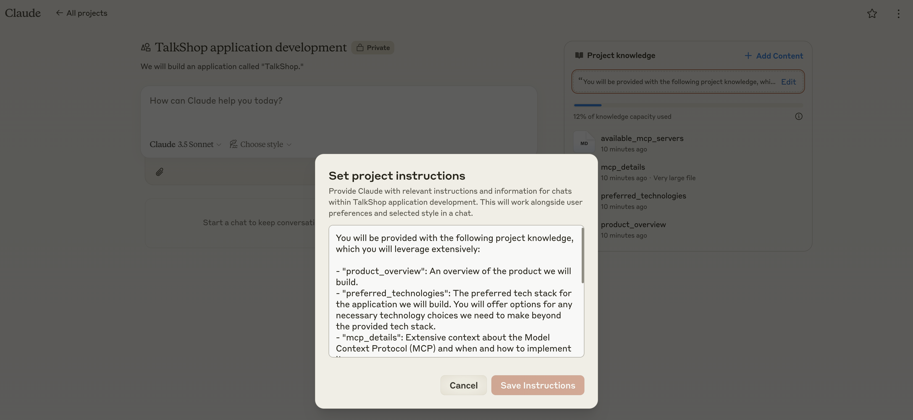

# Natural Language Application Development (NLAD)

NLAD represents a paradigm shift in application development that elevates developers to a higher level of abstraction. By leveraging Large Language Models (LLMs), NLAD allows developers to focus on what they want to build rather than the technical implementation details of how to build it.

## The Vision

NLAD aims to transform application development by:

- **Raising the Abstraction Level**: Express application requirements, design choices, and technical decisions in natural language
- **Automating Implementation Details**: Let LLMs handle the lower-level technical implementations while developers focus on business logic and user experience
- **Bridging Design and Development**: Integrate UI/UX decisions directly into the development process through natural language and visual references
- **Maintaining Developer Control**: While abstracting implementation details, developers retain full control over the final output and can make adjustments as needed

## Why NLAD?

Traditional application development requires developers to:

- Write boilerplate code
- Manually implement standard patterns
- Handle technical integrations
- Manage UI component libraries
- Deal with build configurations
- Write repetitive tests

NLAD transforms this experience by allowing developers to:

- **Express High-Level Intent**: Describe features and functionality in natural language
- **Automate Technical Details**: Let LLMs handle routine implementation tasks
- **Focus on User Experience**: Spend more time on what matters to users
- **Iterate Rapidly**: Quickly prototype and refine applications
- **Design Integration**: Specify design choices through natural language and visual references
- **Future-Proof Development**: As LLM capabilities grow, the level of abstraction can increase

## Current & Future Capabilities

### Available Now

- Natural language specification of application features
- Design integration through natural language and visual inspiration
- Automated technical implementation suggestions
- Integration guidance for APIs and protocols
- Code generation with best practices
- Testing strategy recommendations

### Coming Soon

- **Enhanced Design Capabilities**

  - AI-powered accessibility analysis
  - Animation and interaction specifications
  - Advanced responsive behavior patterns

- **Enhanced Abstractions**
  - Database schema design from natural language
  - API endpoint generation from descriptions
  - Automated state management implementation
  - Security best practices implementation
  - Performance optimization suggestions

## Implementation Platform

NLAD is best implemented using [Claude Projects](https://claude.ai/projects) or similar LLM platforms that support:

- Document attachment capability
- Conversation context maintenance
- Rich markdown formatting
- Code syntax highlighting



## Required Documentation

NLAD requires three core documents to be provided to the LLM:

1. **product_overview.md**

   - Detailed description of the application/service to be built
   - Core features and functionality
   - Business requirements and constraints
   - User interaction flows

2. **preferred_technologies.md**

   - Technology stack choices
   - Framework preferences
   - Architecture decisions
   - Development tools

3. **design_specs.md**

   - Visual inspiration references
   - Brand and style guidelines
   - Component specifications
   - Layout requirements

For newer technologies, protocols, or libraries that may not be in the LLM's training data, additional detailed context should be provided. For example:

- Protocol specifications
- API documentation
- Implementation guides
- Available tools and utilities

### Design Integration

The `design_specs.md` file supports UI/UX specifications through natural language and optional visual inspiration. Developers can provide as much or as little design direction as they prefer, with the LLM filling in unspecified details using best practices and context.

#### Visual Inspiration

Optionally reference up to 3 inspiration images:

1. **Style Reference**: Overall aesthetic and color palette inspiration
2. **Component Reference**: UI patterns and interactive elements
3. **Brand Reference**: Existing brand materials or guidelines

#### Design Specification Example

```markdown
# Design Specifications

## Visual Inspiration

- style_reference.jpg: Modern interface with desired aesthetic
- components.jpg: Example chat interface patterns
- brand.jpg: Current brand guidelines

## Brand Personality

- Modern and efficient
- Trustworthy and professional
  [Additional traits as needed...]

## Color Direction

- Extract palette from style_reference.jpg
- High contrast for accessibility
  [Additional color requirements...]

## Component Design

- Chat Interface: "rounded bubbles with clear user distinction"
- Navigation: "simple and intuitive"
  [Additional component specs...]

## Layout Guidelines

- Mobile-first approach
- Clear visual hierarchy
  [Additional layout requirements...]
```

### Example Documentation

#### product_overview.md

```markdown
I want to build a conversational interface for local businesses called "TalkShop."
This application will:

- Enable natural language interactions between customers and businesses
- Support menu browsing and ordering
- Integrate with delivery services
- Maintain conversation context and customer preferences
- Leverage memory features for personalization
```

#### preferred_technologies.md

```markdown
- TypeScript for type safety and developer experience
- Next.js for the web framework
- TailwindCSS for styling
- PostgreSQL for data storage
- Drizzle ORM for database interactions
- Vercel for deployment
- Additional integrations as needed (e.g., GrubHub API)
```

## Prompt Instructions

A crucial component of NLAD is providing clear instructions to the LLM about the available context and how to use it. These instructions should be concise and specific. Here's an example:

```markdown
You will be provided with the following project knowledge, which you will leverage extensively:

- 'product_overview': An overview of the product we will build.
- 'preferred_technologies': The preferred tech stack for the application we will build.
  You will offer options for any necessary technology choices we need to make beyond
  the provided tech stack.
- 'design_specs': Design requirements and visual inspiration for the application.
- 'api_documentation': Comprehensive documentation about the external API we'll be integrating with.

You will 'hold the user's hand' and walk them step-by-step through creating, building,
and iterating on this application.
```

This instruction format:

- Lists all provided context files
- Explains the purpose of each file
- Provides clear guidance on how the LLM should use this information
- Sets expectations for the interaction style

## How NLAD Works

NLAD is a methodology, not a framework or library. It consists of structured interactions between developers and LLMs, where the LLM acts as an intelligent development assistant. Here's an example workflow:

```
Developer: "I need to integrate the GrubHub API into TalkShop so customers can place
           food delivery orders through our chat interface."

NLAD Assistant: "I'll help you implement the GrubHub integration. Let's break this down:

1. First, let's review the GrubHub API documentation and requirements
2. Then we'll set up the order submission flow
3. Finally, we'll implement the order status tracking

Would you like to start with reviewing the API requirements?"

[Developer and Assistant continue their dialogue, with the Assistant providing guidance,
code snippets, and explanations while the Developer maintains control over implementation]
```

## Core Concepts

1. **Natural Language Interactions**

   - Express requirements in plain English
   - Maintain a dialogue with the development assistant
   - Iterate and refine through conversation

2. **Prompt Engineering Patterns**

   - Structured approaches to common development tasks
   - Reusable prompting strategies
   - Best practices for maintaining control and clarity

3. **Technical Implementation Control**

   - Full visibility into suggested implementations
   - Developer maintains control over code decisions
   - Integration with existing development workflows

4. **Testing and Validation**
   - Guidance on test coverage and validation
   - Best practices for quality assurance

## Case Study: TalkShop

TalkShop is an example application developed using NLAD principles. It demonstrates how complex features can be implemented through natural language interactions:

### Feature: Customer-Business Chat Integration

```
Developer: "I need to implement a chat feature that allows customers to interact
           with local businesses. The chat should support menu browsing, ordering,
           and order status updates."

NLAD Assistant: "Let's design this chat feature. We should consider:
1. Real-time communication infrastructure
2. Message state management
3. Business logic for menu and order handling
4. User interface components

Which aspect would you like to explore first?"

[The dialogue continues, with the Assistant guiding architectural decisions
and implementation details while the Developer maintains control]
```

### Feature: Memory Integration

```
Developer: "We need to implement a system to remember customer preferences and
           past orders across conversations. How should we approach this?"

NLAD Assistant: "This memory system will require several components:
1. Customer profile management
2. Order history tracking
3. Preference learning algorithms
4. Memory persistence strategy

Let's start by designing the customer profile schema..."
```

## Contributing

We welcome contributions to the NLAD methodology! Share your experiences, suggest improvements, or help expand the documentation. See our [Contributing Guide](CONTRIBUTING.md) for details.

## License

This documentation is licensed under the MIT License - see the [LICENSE](LICENSE) file for details.

## Community

- [GitHub Discussions](https://github.com/Matt-Dionis/nlad/discussions) - For methodology discussions and questions
- [GitHub Issues](https://github.com/Matt-Dionis/nlad/issues) - For documentation improvements and suggestions

---

Built with ❤️ by the NLAD Community
